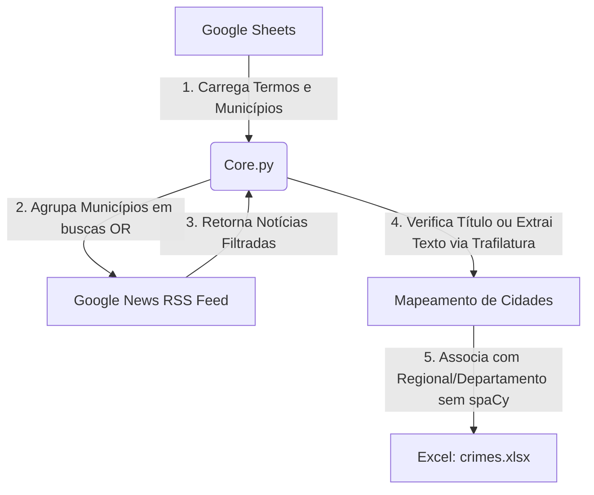

# CrimesNews 📰⚖️

O **CrimesNews** é uma ferramenta em Python desenvolvida para monitorar, extrair e classificar notícias relacionadas a crimes em municípios específicos, correlacionando-as geograficamente. A nova versão foi redesenhada de forma extremamente simplificada, leve, rápida e moderna para evitar bloqueios de robôs e remover dependências desnecessárias.

---

## 🛠️ Arquitetura e Fluxo de Funcionamento (Simplificado & Otimizado)

O sistema opera seguindo as seguintes etapas otimizadas:



1. **Obtenção de Parâmetros (Google Sheets):**
   * O script lê os termos de busca (ex: "homicídio", "furto") e a lista de municípios (com Regional e Departamento) diretamente de uma planilha do Google Drive.
2. **Consultas Agrupadas por OR (Query Grouping):**
   * Em vez de fazer uma consulta para cada cidade (o que geraria centenas de requisições e causaria bloqueio), os municípios são agrupados em blocos (ex: 15 cidades por vez).
   * Uma única consulta focada é feita ao RSS do Google News:
     `"termo" ("Cidade1" OR "Cidade2" OR ...)`
3. **Mapeamento de Cidades e Remoção do spaCy:**
   * O sistema analisa se alguma cidade do grupo está presente no **título** da notícia. Se estiver, a notícia é associada e classificada imediatamente, evitando qualquer requisição externa adicional.
   * Se a cidade não estiver no título, o link é decodificado com a biblioteca `googlenewsdecoder` e o texto do site é extraído com `trafilatura` para fazer a correspondência direta de texto sem acentos. Não é necessário carregar ou instalar o `spaCy`.
4. **Interface Gráfica e Relatórios:**
   * A aplicação exibe os dados e gráficos em uma interface moderna no **Streamlit** e permite exportar o relatório Excel consolidado (`crimes.xlsx`).

---

## 📁 Estrutura do Projeto

* **`Core.py`**: Motor da ferramenta. Contém as regras de negócio, decodificação de URLs, extração de texto via `trafilatura` e paralelização em blocos.
* **`app.py`**: Nova interface web interativa desenvolvida em **Streamlit**. Substitui a antiga interface Tkinter e permite ver o progresso das tarefas em tempo real, tabelas interativas e gráficos estatísticos.
* **`CrimesNews-Cli.py`**: CLI padrão para execução rápida via terminal.
* **`Dockerfile`**: Configuração dockerizada configurada para inicializar o Streamlit na porta 8080.
* **`docker-compose.yml`**: Orquestração simplificada para rodar a aplicação em containers com suporte a hot-reload.
* **`pyproject.toml`** / **`poetry.lock`**: Dependências do projeto gerenciadas via Poetry.

---

## 📦 Dependências Principais

* **`feedparser`**: Leitura rápida e parsing do feed RSS do Google News.
* **`googlenewsdecoder`**: Decodificador moderno de URLs ofuscadas/redirecionadas do Google News.
* **`trafilatura`**: Extrator de texto web de alta performance e à prova de bloqueios de boilerplate.
* **`streamlit`**: Framework para a interface web.
* **`pandas`** & **`openpyxl`**: Geração do relatório Excel.

---

## 🚀 Como Executar

### Opção 1: Usando Docker e Docker Compose (Recomendado)

Certifique-se de ter o Docker e Docker Compose instalados em sua máquina.

1. **Subir o container da aplicação:**
   ```bash
   docker compose up --build
   ```

2. **Acessar o Streamlit**:
   Abra seu navegador no endereço: [http://localhost:8080](http://localhost:8080).

---

### Opção 2: Execução Local Nativa

Certifique-se de ter o Python 3.9+ e o [Poetry](https://python-poetry.org/) instalados.

1. **Instalar Dependências:**
   ```bash
   poetry install
   ```

2. **Executar via Interface Web (Streamlit):**
   ```bash
   poetry run streamlit run app.py
   ```

3. **Executar via CLI (Linha de Comando):**
   ```bash
   poetry run python CrimesNews-Cli.py
   ```
